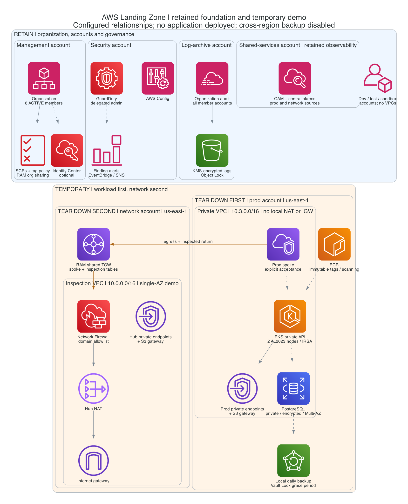

# AWS Landing Zone

A standalone, best-practice AWS landing zone built from bespoke Terraform: a
multi-account AWS Organization with preventive guardrails, centralized logging
and detective controls, federated human identity, and a centralized egress
inspection network. It deploys, proves its own guardrails, and destroys back to a
near-zero footprint.



## The problem it solves

A single AWS account with good intentions drifts. Someone turns off CloudTrail to
quiet an alarm, a bucket goes public for a quick test and stays that way, a
forgotten NAT gateway bills for a year, and the blast radius of one leaked
credential is everything. This zone is the opposite posture: separate accounts
per environment, guardrails applied at the org so they are inherited and cannot
be turned off from inside a workload, one immutable place all the logs land, and
one path to the internet that is inspected. The controls are preventive where a
deny is possible, not just detective.

## How AWS differs from the Azure and GCP zones

All three zones build to the same design. The parts specific to AWS:

- Isolation is by **account**, and the boundary is enforced by **SCPs** attached
  to OUs, so a member account cannot escape a control by acting locally. Azure
  uses Azure Policy at management-group scope; GCP uses org policies at the
  folder or org root.
- The management account is **SCP-exempt by design**, so the guardrails are
  attached below it and root hardening on the management account is a separate,
  documented step.
- Centralized egress runs through a **Transit Gateway** and an inspection VPC
  with **AWS Network Firewall**, shared to the org over RAM. Azure forces egress
  through Azure Firewall with a UDR; GCP uses hierarchical firewall policies and
  Cloud NAT.
- Admin access is **SSM Session Manager** over interface endpoints. There is no
  bastion and no public SSH.

## What gets built

Five Terraform roots. The accounts root is permanent and free. The governance
and observability roots are nearly free and come and go with each demo. The
network and workload roots are the hourly-billed layers, kept separate so they
come up only for their demo and are destroyed on their own.

### Accounts root (`accounts/`), permanent

| Pillar | Resources | Why |
|---|---|---|
| Hierarchy | Security, Infrastructure, Workloads (Dev/Test/Prod), Sandbox OUs; security, network, shared-services, log-archive, dev, test, prod, sandbox accounts | Separate accounts are the real isolation boundary; Prod sits under stricter inherited policy |
| Guardrails | SCPs (deny root, deny leave-org, region lockdown, require S3 encryption, deny public S3, deny disabling detective services); org tag policy | Preventive, inherited, and unturnoffable from inside a workload |

No teardown touches this root. Accounts carry `close_on_deletion = false` and
`prevent_destroy`, so they stay ACTIVE between demos. A closed account would sit
SUSPENDED for 90 days, holding org quota and its email alias, and the next deploy
would collide with it. Idle accounts cost nothing. The other roots read account
ids from this root's state.

### Governance root (`terraform/`)

| Pillar | Resources | Why |
|---|---|---|
| Logging | Org CloudTrail to an Object-Lock (WORM) S3 bucket in log-archive, KMS-encrypted, log-file validation | One immutable record of what happened, safe from the account that generated it |
| Detective | GuardDuty + Security Hub (CIS AWS Foundations 1.4.0) + AWS Config, delegated to the security account | Security operations run outside the account that can change the org |
| Encryption | KMS CMK with rotation, key policy scoped to the CloudTrail/Config services | One key family controls the whole audit record |
| Identity | IAM Identity Center personas (admin, platform-eng, junior-eng, manager, finops, security, break-glass) with permissions boundaries and short sessions | No IAM users; access is a group membership and a short session, no standing prod write |
| Root hardening | Strict password policy; EventBridge alarm on any root use | The account nobody should log in with cannot be used quietly |
| Cost | Monthly budget + Cost Anomaly Detection | Catches a forgotten hourly resource before the invoice does |

### Network root (`network/`)

| Pillar | Resources | Why |
|---|---|---|
| Connectivity | Transit Gateway, RAM-shared to the org, explicit attachment acceptance | Spokes attach to reach the internet; no auto-join |
| Inspection | Egress VPC, AWS Network Firewall (domain-allowlist default-deny), NAT, routing that forces egress and return through the firewall | Nothing reaches the internet without passing the firewall; the default-deny is what will enforce the pull-through cache |
| Private access | Interface endpoints (SSM, ECR, Secrets Manager, Logs) + S3 gateway endpoint | Registry, secrets, and logging over private IPs; SSM gives admin access with no bastion |
| Telemetry | VPC flow logs, firewall flow and alert logs to CloudWatch | A record of what traversed the hub |

### Workload root (`workload/`), the prod paved road

| Pillar | Resources | Why |
|---|---|---|
| Prod VPC | Private VPC (10.3.0.0/16), no IGW/NAT, TGW-attached; egress inherits the hub firewall | A workload account with no independent path to the internet |
| Data segmentation | App and DB security groups (only the app tier reaches the DB on 5432) + a data-subnet NACL | Least-access data tier; see the who-can-talk-to-whom matrix in the data-tier doc |
| Database | RDS PostgreSQL, Multi-AZ, gp3, CMK-encrypted, private, RDS-managed secret | Active-passive failover, no password in state |
| Backup | AWS Backup Vault Lock (WORM) + cross-region copy | Immutable backups, a defense against ransomware not just failure |
| Cluster | EKS with a private API, KMS-encrypted etcd secrets, IRSA | Pods get scoped IAM, no node-wide keys, no public control plane |
| Supply chain | ECR (immutable tags, scan-on-push) + pull-through cache + Inspector; EC2 Image Builder | Private registry as the only image source; hardened node AMIs |
| Workload metrics | Container Insights (`amazon-cloudwatch-observability` add-on) on an IRSA role, plus a `monitoring` endpoint | Node and pod health as CloudWatch metrics, alarmed centrally ([ADR-0002](docs/adr/0002-eks-metrics-container-insights.md)) |

### Observability root (`observability/`)

| Pillar | Resources | Why |
|---|---|---|
| Finding routing | EventBridge rules in the security account: GuardDuty severity 7+ and Security Hub HIGH/CRITICAL (GuardDuty duplicates excluded) to a `security-findings` topic | Every serious finding in the org lands in one place a runbook can subscribe to |
| Monitoring account | Shared-services holds a CloudWatch OAM sink; prod and network link to it with metrics, logs, and traces | Alarms and dashboards live where no workload team can change them, while data stays in the account that produced it |
| Central alarms | RDS CPU and free storage, EKS failed nodes, Network Firewall dropped packets, AWS Backup failed jobs, each reading its source account through OAM, to an `ops-alarms` topic on ALARM and OK | One alarm plane and one input for the incident responder |
| Encryption | A customer-managed KMS key per alert topic, granting only EventBridge or CloudWatch for that topic | Neither service can publish to a topic under the AWS-managed `aws/sns` key |

`make test-observability` raises a GuardDuty sample finding and checks the
publish, confirms both source accounts' metrics are visible in the monitoring
account, and forces an alarm to confirm its SNS action succeeds.

## Deploy, test, destroy

The credentialed operations run through the reviewer-gated CI (see the ADRs) or
locally with admin credentials:

```bash
make deploy    # accounts, governance, then the hourly network + workload roots
make test      # proves the guardrails DENY, not just that apply succeeded
make destroy   # tears down everything but the accounts, then verifies
```

- `make deploy` applies the accounts root (a no-op once the accounts exist) and
  the governance root, then feeds the accounts root's `network_account_id`,
  `prod_account_id`, and `organization_arn` outputs into the network and
  workload roots.
- `make test` runs `scripts/validate.sh` (the OU/SCP structure and live deny
  checks: region lockdown, CloudTrail tampering, management exemption) and
  `scripts/test-guardrails.sh` (org trail is logging, GuardDuty admin is the
  security account, and disabling Config or GuardDuty in a workload returns
  AccessDenied under the SCP).
- `make destroy` destroys the workload and network roots, empties the
  Object-Lock buckets with a governance-retention bypass, destroys the
  governance root, then runs `scripts/verify-teardown.sh`. That script fails if
  any hourly resource remains or any member account is no longer ACTIVE.

## Cost and teardown traps

The guardrail and topology layer is nearly free. The cost risk is a forgotten
hourly resource, which is exactly what the TTL guard and `verify-teardown.sh`
exist to catch.

| | Cost |
|---|---|
| Standing after destroy | ~$1 to $3/mo (KMS keys only, during their deletion window); accounts, OUs, and SCPs stay at $0 |
| Demo window, governance + network | a few dollars, driven by NAT + Network Firewall while up |
| Demo window, workload | adds RDS Multi-AZ + EKS control plane + endpoints while up; destroy the workload root as soon as its demo is done |

Teardown traps this repo handles:

- **Object-Lock buckets.** The trail and config buckets use GOVERNANCE-mode WORM,
  so `force_destroy` alone cannot empty them. `scripts/empty-locked-buckets.sh`
  deletes each version with `--bypass-governance-retention` before the destroy.
- **Order.** The network root is destroyed before the governance root, so the TGW
  and inspection VPC release cleanly.
- **What is allowed to remain.** The accounts root (free) and a KMS key pending
  deletion (~$1/mo until its window closes) are the only things left standing,
  by design.

## Documentation

- [docs/cis-mapping.md](docs/cis-mapping.md): CIS AWS Foundations control IDs
  mapped to the exact Terraform resource or policy, with honest N/A rows.
- [docs/access-model.md](docs/access-model.md): the persona-by-scope matrix and
  the CIS control each row satisfies.
- [docs/accelerator-vs-bespoke.md](docs/accelerator-vs-bespoke.md): why this is
  hand-written Terraform rather than Control Tower or the Landing Zone Accelerator.
- [docs/data-tier.md](docs/data-tier.md): the data-tier segmentation matrix, the
  RTO/RPO of the failover, backup immutability, and the EKS paved road.

## Pipeline

CI runs the shared [platform-guardrails](https://github.com/jordann6/platform-guardrails)
static gates (gitleaks, fmt/validate, tflint, Checkov, Trivy, conftest OPA) on
the accounts, governance, network, workload, and observability roots. OPA checks
required tags and CostCenter. A repo-local Infracost workflow gates network,
workload, and observability changes at a $50/month increase, with an explicit
`cost-approved` PR label override. It runs before the PR report, rejects missing
cost estimates, and stores each root's report separately. Hosted Infracost
policy enforcement is disabled because its example tagging rules conflict with
the organization's tag policy. Pricing estimates still use the Infracost API.

The OIDC plan job and scheduled TTL trigger are currently disabled. Apply and
destroy workflows are available by manual dispatch; local credentialed applies
and destroys are run by the operator using reviewed, saved plans.
